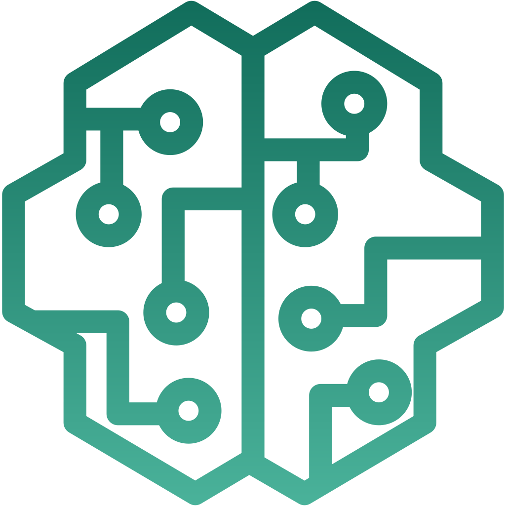

  

<h1 align="center">
	AWSome SageMaker
</h1>

  
  

> A curated list of awesome references for Amazon SageMaker.

:ledger: The curated list consists of the following sections.  

* [**Getting Started**](./getting_started.md)  - Start here if you are setting up Sagemaker (including studio)
  - [Introduction](./getting_started.md#introduction)
  - [Developer Experience](./getting_started.md#developer-experience)
  - [Architecture Best Practices](./getting_started.md#architecture-best-practices) 
  - [ML Platform Setup](./getting_started.md#ml-platform-setup)

* [**Data Preparation**](./data_preparation.md) - Understand the options to prepare data for machine learning  
  - [Data Processing](./data_preparation.md#data-processing)  
  - [Large Scale Data Processing](./data_preparation.md#large-scale-data-processing)   
  - [Data Labeling](./data_preparation.md#data-labeling)

* [**Building ML Models**](building_ml_models.md) - Contains resources for running notebooks and training models
  - [SDKs and Infrastructure-as-code](./building_ml_models.md#sdks--infrastructure-as-code)
  - [Training](./building_ml_models.md#training)

* [**Deploying ML Models**](deploying_ml_models.md) - Different ways to deploy models and their best practices
  - [Inference](./deploying_ml_models.md#inference)
  - [Hardware Acceleration](./deploying_ml_models.md#hardware-acceleration)
  - [Edge Deployments](./deploying_ml_models.md#edge-deployments)
  - [Debugging](./deploying_ml_models.md#debugging)  

* [**MLOps**](mlops.md) - Machine Learning Operations
  - [MLOps Foundations](./mlops.md#mlops-foundations)
  - [SageMaker Pipelines](./mlops.md#sagemaker-pipelines)
  - [Third-Party](./mlops.md#using-third-party) 
  - [Experiment Tracking and Model Registry](./mlops.md#experiment-tracking--model-registry)
  - [Data Versioning and Feature store](./mlops.md#data-versioning--feature-store)
  - [Model Monitoring](./mlops.md#model-monitoring)

* [**Low Code / No Code ML**](low_code_no_code_ml.md) - Low code approach to date preparation and model building
  - [Low Code - No Code](./low_code_no_code_ml.md#low-code-no-code)
  - [AutoML](./low_code_no_code_ml.md#automl)
  - [Data Wrangler](./low_code_no_code_ml.md#data-wrangler)

* [**Generative AI**](generative_ai.md) - deploy and use generative AI models
  - [Train and deploy Foundational Models](./generative_ai.md#train-and-deploy-foundational-models)
  - [prompt engineering and few shot/zero shot learning](./generative_ai.md#prompt-engineering-and-few-shotzero-shot-learning)
  - [Fine tune Foundational Models](https://github.com/aws-samples/awesome-sagemaker/blob/main/generative_ai.md#fine-tune-foundational-models)
  - [Building Generative AI applications](./generative_ai.md#building-generative-ai-applications)

* [**ML Domains**](ml_domains.md) - Deep dive on domains such as NLP, CV, Tabular, Audio and Reinforcement Learning
  - [Responsible AI](./ml_domains.md#responsible-ai)
  - [ML Governance](./ml_domains.md#ml-governance) ([Model Management](./ml_domains.md#model-management), [Security](./ml_domains.md#security), [Cost Tracking & Control](./ml_domains.md#cost-tracking--control))
  - [Computer Vision](./ml_domains.md#computer-vision)
  - [Natural Language Processing](./ml_domains.md#natural-language-processing)
  - [R](./ml_domains.md#r)
  - [Audio](./ml_domains.md#audio)

* [**Learning Sagemaker**](learning_sagemaker.md) - Trainings, certifications, books and community
  - [Certification](learning_sagemaker.md#certification)
  - [MOOCs](learning_sagemaker.md#moocs)
  - [Digital & Classroom](learning_sagemaker.md#digital--classroom)
  - [Tutorials](learning_sagemaker.md#tutorials)
  - [Community](learning_sagemaker.md#community)
  - [Books](learning_sagemaker.md#books)
  - [News](learning_sagemaker.md#news)

## :handshake: Contributing

If you'd like to open an issue, for having a defunct link removed or corrected, or you want to propose interesting content and share it into the list through a pull request, please read our [contributing guidelines](./CONTRIBUTING.md).
The pull request will be evaluated by the project owners and incorporated into the list. Please ensure that you add the link to the appropriate sub-page and the link points to unique content that is not already covered by one of the other links.
We're extremely excited to receive contributions from the community, and we're still working on the best mechanism to take in examples from external sources.
